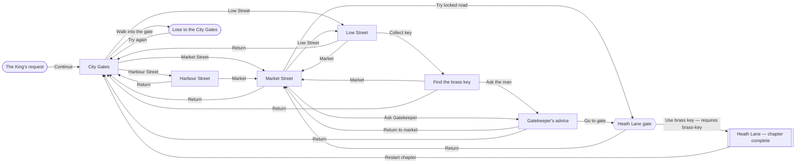

# Demon — current playable story map

_Generated from [`content/story-map.yaml`](../content/story-map.yaml) by `ruby scripts/render-story-map.rb`. Edit the YAML, not this diagram._

## Current playable slice

## Legend

- Rounded: start or comic failure scene.
- Double-bordered: chapter end.
- Diamond: checkpoint; an edge label states any requirement.
- Rectangles: locations, discoveries, or conversations.

## How to use this map

- A node names one current screen or a planned narrative beat and records its matching screen ID where it exists.
- An edge is a player route; its label records the action and its requirements.
- Node `gives` fields record the knowledge or item unlocked there, even where the current prototype does not yet represent that knowledge in runtime state.
- Add future character encounters, maxim learning, optional routes, and checkpoints here before writing their detailed screens.
- The map is the planning backbone, not a replacement for `content/demon.json`; the JSON remains the authoritative live screen definition.
