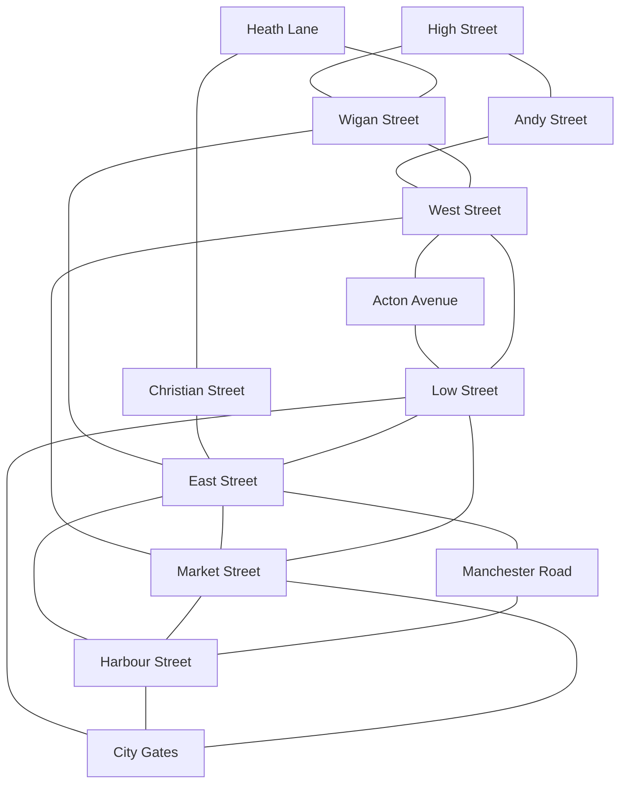

# Gaalway street graph

This is the canonical, editable interpretation of the original hand-drawn city map. It is deliberately separate from the archival photograph: if recovered GW-BASIC code proves a connection wrong, update this document and `content/world.yaml` together.

## Street placement

| Street | Orientation | Map position |
| --- | --- | --- |
| High Street | Horizontal | Upper-left |
| Heath Lane | Horizontal | Upper-right |
| Andy Street | Vertical | Upper-left |
| Wigan Street | Vertical | Upper-centre |
| Christian Street | Vertical | Upper-right |
| West Street | Horizontal | Centre-left |
| East Street | Horizontal | Centre-right |
| Acton Avenue | Vertical | Bottom-left |
| Market Street | Vertical | Bottom-centre |
| Manchester Road | Vertical | Bottom-right |
| Low Street | Horizontal | Lower-left |
| Harbour Street | Horizontal | Lower-right |
| City Gates | Landmark/entrance | Lower centre |

## Route examples

- Low Street → West Street → Acton Avenue
- Low Street → East Street → Harbour Street
- Low Street → East Street → Market Street
- High Street → Wigan Street → East Street
- City Gates → Market Street → Harbour Street

The first three routes are retained as explicit navigation checks when the full game engine is implemented.
